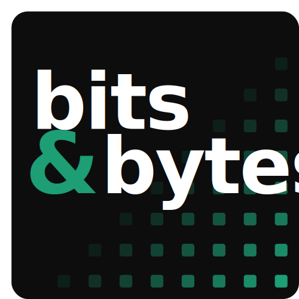
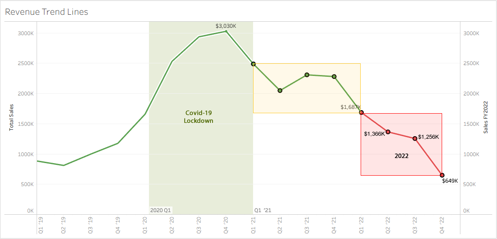
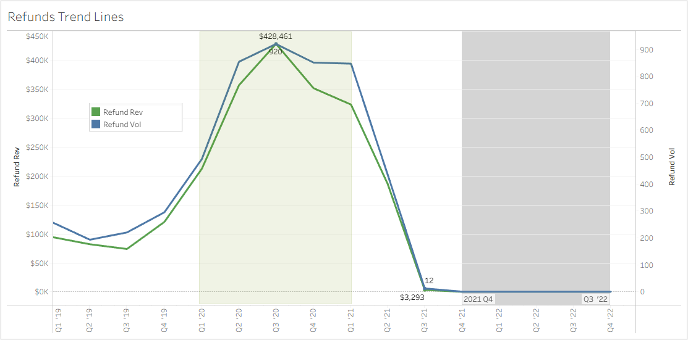
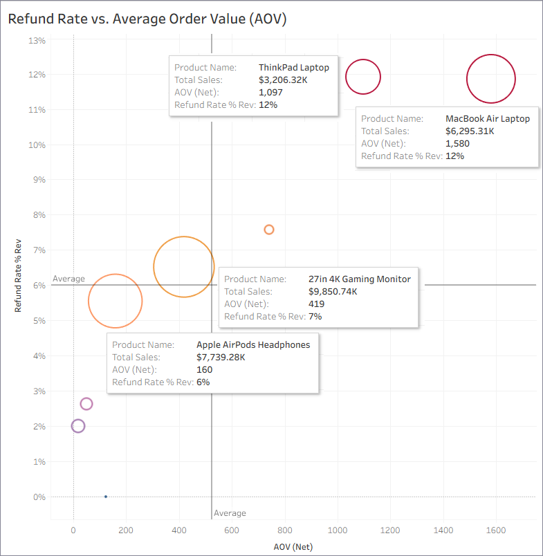

<!-- --><!--img src="Bits&Bytes-ppt-banner-logo3.png"-->

# 
Sales Performance Review

A structured analysis of sales trends, growth rates, loyalty program ROI, and order economics

<b>Period:</b> Q1 2019 – Q4 2022 &nbsp;|&nbsp; <b>Team:</b> Revenue Analytics &nbsp;|&nbsp; <b>Last updated:</b> Apr 2023

---

## Executive Summary

**Strong momentum across all four metrics — three clear actions follow.**
<!-- https://img.shields.io/badge/Sales-Up%20YoY-2da44e?style=flat-square (up/green) -->
<!-- https://img.shields.io/badge/Sales-Down%20YoY-c41e3a?style=flat-square (down/red) -->
<!--
Encoding Comparison
Character 	Name	Hex Code (Percent Encoded)
+	Plus sign	2B (%2B)
-	Hyphen-minus	2D (%2D)
_	Underscore	5F (%5F)
.	Period	2E (%2E)
-->
&nbsp;&nbsp;&nbsp;
&nbsp;&nbsp;&nbsp;
&nbsp;&nbsp;&nbsp;
&nbsp;&nbsp;&nbsp;

---

## 1. Overall Sales Trends (2019-2022)

### FY22 Sales Momentum Decelerated Each Quarter — Full-Year Revenue Hit a Two-Year Low

*Visualization: Line chart · full period · annotate inflection points*

  

<table>
 <tr>
  <td valign="top">
   

    <b>Revenue Growth and Peak Performance:</b>
    <ul>
     <li>FY2019-FY201 saw a YoY healthy and steady growth of 25% (up by $1M).</li>
     <li>FY2020 was the strongest year, with sales consistently growing each quarter as a result of the COVID-19 pandemic.</li>
    <li>Q4 FY2020 saw revenue peaked at $3M ($1.25M in December 2020), making it the best-performing period.</li>    
    </ul>
   

   

    <b>Declining Trend in 2021</b>
    <ul>
     <li>Q1-Q2 FY2021 saw the beginning of the market cooling down by $1M.</li>
     <li>A sales anomaly and significant decline occurred in 2022, particularly in Q4, with October ($178K), November ($208K), and December ($262K) marking the lowest revenue months.</li>
     <li>The Q3 and Q4 revenue decline suggests a major downturn, likely caused by external market conditions, reduced consumer demand, or internal operational shifts.</li>
    </ul>
   

  </td>
  <td valign="top">
   

    <b>Quarterly Insights & Seasonal Trends</b>
    <ul>
    <li>Q3 and Q4 of each year typically show strong performance, likely due to seasonal shopping trends and marketing efforts.</li>
    <li>Q1 2022 started well ($704K in January), but revenue quickly dropped, signaling an overall weak performance compared to previous years.</li>
    </ul>
   

   

    <b>Key Takeaways & Recommendations</b>
    <ul>
    <li>Investigate the causes of the 2022 decline (e.g., market changes, competition, internal factors).</li>
    <li>Leverage high-performing periods (e.g., Q3 and Q4 of strong years) to refine marketing and sales strategies.</li>
    <li>Reassess business strategy for 2023, focusing on pricing, promotions, and customer engagement to regain momentum. </li>
    </ul>
   

  </td>
 </tr>
</table>

---

### Negative Performance Was Universal — All Four Channels Suffered Severe Sales Losses

*Visualization: Channel breakdown · stacked bar or small multiples*

- **Direct:** -49% YoY
- **Social Media:** -56% YoY
- **Email:** -37% YoY
- **Affiliate:** -33% YoY

  

<table>
 <tr>
  <td valign="top">
   

    <b>Revenue Growth and Peak Performance:</b>
    <ul>
     <li>FY2019-FY201 saw a YoY healthy and steady growth of 25% (up by $1M).</li>
     <li>FY2020 was the strongest year, with sales consistently growing each quarter as a result of the COVID-19 pandemic.</li>
    <li>Q4 FY2020 saw revenue peaked at $3M ($1.25M in December 2020), making it the best-performing period.</li>    
    </ul>
   

   

    <b>Declining Trend in 2021</b>
    <ul>
     <li>Q1-Q2 FY2021 saw the beginning of the market cooling down by $1M.</li>
     <li>A sales anomaly and significant decline occurred in 2022, particularly in Q4, with October ($178K), November ($208K), and December ($262K) marking the lowest revenue months.</li>
     <li>The Q3 and Q4 revenue decline suggests a major downturn, likely caused by external market conditions, reduced consumer demand, or internal operational shifts.</li>
    </ul>
   

  </td>
  <!--td valign="top">
   

    <b>Quarterly Insights & Seasonal Trends</b>
    <ul>
    <li>Q3 and Q4 of each year typically show strong performance, likely due to seasonal shopping trends and marketing efforts.</li>
    <li>Q1 2022 started well ($704K in January), but revenue quickly dropped, signaling an overall weak performance compared to previous years.</li>
    </ul>
   

   

    <b>Key Takeaways & Recommendations</b>
    <ul>
    <li>Investigate the causes of the 2022 decline (e.g., market changes, competition, internal factors).</li>
    <li>Leverage high-performing periods (e.g., Q3 and Q4 of strong years) to refine marketing and sales strategies.</li>
    <li>Reassess business strategy for 2023, focusing on pricing, promotions, and customer engagement to regain momentum. </li>
    </ul>
   

</td-->
 </tr>
</table>

---

## 2. Monthly & Yearly Growth Rates

### Growth Stalled in Back-Half Months — Annual Rate Fell From 18% to 6%

*Visualization: Dual chart · MoM rate left · YoY rate right*

> `[ MoM + YoY growth chart ]`

---

### Seasonality Explains the Mid-Year Dip — Adjusted Growth Remains On Track

*Visualization: Seasonality-adjusted overlay · rule out alternative explanations*

---

## 3. Loyalty Program Performance

### Loyalty Members Spend 40% More Per Visit — the Program Is Driving Real Revenue

*Visualization: Member vs. non-member comparison · spend, retention, redemption rate*

- **Avg. member spend:** $131 vs $94 non-member
- **Redemption rate:** 64% (up from 41% prior year)
- **Retention:** 89% among active loyalty users

---

### The Verdict: Keep the Program — and Double Down on These Two Improvements

*Direct recommendation · evidence-backed · answers "should we keep it?"*

---

## 4. Refund Rates & Average Order Value

### Refunds Not Captured from Q4-2021 through Q4-2022 due to CRM Integration issue - Risk Assessment WIP

*Visualization: Dual-axis chart · refund rate vs AOV · show the inverse relationship*

  

### Refund Rates Dropped to a Two-Year Low as Average Order Value Climbed to $94

*Visualization: Dual-axis chart · refund rate vs AOV · show the inverse relationship*

  

---

### Higher AOV Is Driven by Premium Laptop Purchases — Accounts for elevated returns as well

*Visualization: AOV decomposition · bundles vs. single-item vs. price lift*

- **Bundle attach rate** grew from 22% → 41%
- **Price increase** contributed only $4 of $33 AOV gain

---

## 5. Next Steps

### Three Priorities for Next Quarter — With Owners and Deadlines

| Priority | Action |
|---|---|
| **Priority 1** | Expand loyalty tier structure |
| **Priority 2** | Scale bundle merchandising |
| **Priority 3** | Address Q2 refund root cause |

---

*Bits&Bytes Commerce Inc. · Revenue Analytics · Confidential &nbsp;|&nbsp; `sales-performance-review · v1.2.0`*

---

## About The Project 

### Company
**Bits&Bytes Commerce Inc.(B&B)** is a privately held eCommerce company based in Houston Texas that sells top-brand consumer electronics and accessories like Apple, Samsung, and ThinkPad to a global clientele. The company has successfuly pivoted, grown and expanded since it's launch in 2018 from being a B2B reseller to a Direct-to-Consumer retailer. At the beginning of 2020, it has encountered increasing competition within the industry as well as unique challenges and opportunities brought on by the COVID-19 pandemic.

### Operational Data
**B&B’s** current book of business encompasses nearly **88,000 customers** and more than **108,000 transactions**, yielding a total sales revenue exceeding **$28M USD**. The accompanying eCommerce dataset provides comprehensive data across multiple dimensions, including product performance, regional sales distribution, and loyalty program engagement.

  
 B&B Entity Relationship Diagram (ERD)

 ### The Ask
In coordination with the Head of Operations, an in-depth analysis was conducted to evaluate **B&B’s** performance over the period of 2019–2022. This comprehensive review provides valuable insights that Angie Lopez (Head of Operations) and the various internal cross-functional teams will utilize to streamline processes and enhance **B&B’s** commercial performance for FY23 and beyond. The key insights and recommendations focus on the following areas:
 
#### Northstar Metrics
* **Sales trends** - Focusing on key metrics of sales revenue, number of orders placed, and average order value (AOV).
* **Product performance** - Analyzing different product lines, market impact, and refund rates to inform strategic product decisions.
* **Loyalty program evaluation** - Evaluating the effectiveness of the company's loyalty program and providing recommendations to maximize customer engagement and retention.
* **Regional results** - Evaluating regional demand and product performance within regions to identify areas for improvement.

---

  

